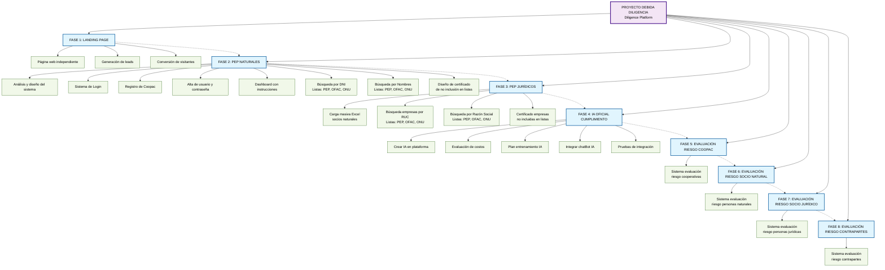

# PROYECTO DEBIDA DILIGENCIA 
Diligence es una plataforma de software empresarial especializada en procesos de diligencia debida para transacciones corporativas complejas. La solución proporciona capacidades avanzadas de análisis de riesgo y evaluación de contrapartes, permitiendo a las organizaciones realizar evaluaciones comprehensivas de personas y entidades terceras antes de establecer relaciones comerciales estratégicas o completar operaciones de fusión y adquisición.

# FASE 1 : UNA LANDING PAGE
Es una página web independiente, diseñada con un objetivo específico en mente, usualmente dentro de una campaña de marketing. Su propósito principal es convertir a los visitantes en clientes potenciales o leads, guiándolos a través de una acción deseada, como rellenar un formulario, realizar una compra o descargar un recurso.

# FASE 2 : PROYECTO DEBIDA DILIGENCIA -> PEP (NATURALES)
- Análisis y diseño del sistema
- Login
- Registro de Coopac
- Alta de usuario contraseña de Coopac
- Dashboard con instrucciones de uso
- Buscar de personas DNI listas PEP, OFAC, ONU...
- Buscar de personas Nombres y Apellidos listas PEP, OFAC, ONU...
- Armar diseño de certificado que la(s) personas buscadas no se encuentren en la listas del sistema.

# FASE 3 : PROYECTO DEBIDA DILIGENCIA -> PEP  (JURÍDICOS)
- Cargar de Excel segun formato para carga masiva de socios naturales
- Buscar de empresas RUC listas PEP, OFAC, ONU...
- Buscar de empresas Razon social listas PEP, OFAC, ONU...
- Armar diseño de certificado que la(s) personas buscadas no se encuentren en la listas del sistema.

# FASE 4 : PROYECTO DEBIDA DILIGENCIA -> IA (OFICIAL DE CUMPLIMIENTO)
- Crear IA en plataforma de sevicios
- Evalucación de costos
- Plan de entrenamiento de la IA
- Integrar chatBot IA con el proyecto.
- Pruebas de integración

# FASE 5 : PROYECTO DEBIDA DILIGENCIA -> GENERAR EVALUACIÓN  DE RIESGO DE COOPAC
# FASE 6 : PROYECTO DEBIDA DILIGENCIA -> GENERAR EVALUACIÓN  DE RIESGO DE SOCIO NATURAL
# FASE 7 : PROYECTO DEBIDA DILIGENCIA -> GENERAR EVALUACIÓN  DE RIESGO DE SOCIO JURÍDICO
# FASE 8 : PROYECTO DEBIDA DILIGENCIA -> GENERAR EVALUACIÓN  DE RIESGO DE CONTRAPARTES
